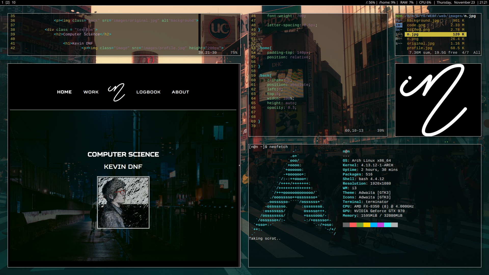

# Kevin Linux rice

## Hardware used

Laptop - Compaq Presario CQ61i  
OS     - Arch 
CPU    - Intel Celeron T3100 @ 1.89GHz  
GPU    - Intel Integrated Graphics  
RAM    - 2GB  

PC	   -  
OS     - Arch 
CPU    - AMD FX8350  
GPU    - Nvidia GTX970  
RAM    - 32GB DDR3  

## Programs used  

+ Terminal emulator - Terminator  
+ Window Manager - i3-gaps  
+ Web Browser - Vivaldi (with Vimum)  
+ File browser - Ranger  
+ Composite Manager - Compton  
+ Text Editor - Vim  
+ Music Player -  
+ Pdf viewer - MuPdf  

