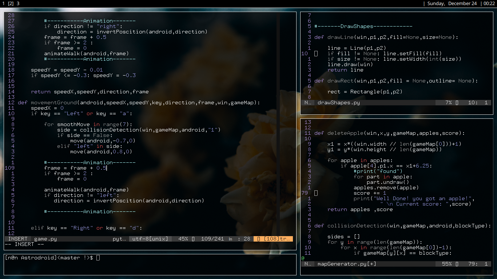

# Kevin Linux rice

## Hardware used

Laptop - Compaq Presario CQ61i  
OS     - Arch  
CPU    - Intel Celeron T3100 @ 1.89GHz  
GPU    - Intel Integrated Graphics  
RAM    - 2GB  

PC       
OS     - Arch  
CPU    - AMD FX8350 @ 4.00GHz  
GPU    - NVIDIA GTX970  
RAM    - 32GB DDR3  

RPI3 B+  
OS	   - Raspbian 

## Programs used  

+ Terminal emulator  -  rxvt-unicode-patched  
+ Window Manager     -  i3-gaps  
+ Status Bar		 -  Polybar
+ Web Browser	     -  Vivaldi (with Vimum)  
+ File browser	     -  Ranger  
+ Composite Manager  -  Compton  
+ Text Editor	     -  Vim  
+ Music Player	     -  Cmus  
+ PDF viewer	     -  MuPDF & Evince  
+ D-Menu	         -  Rofi  
