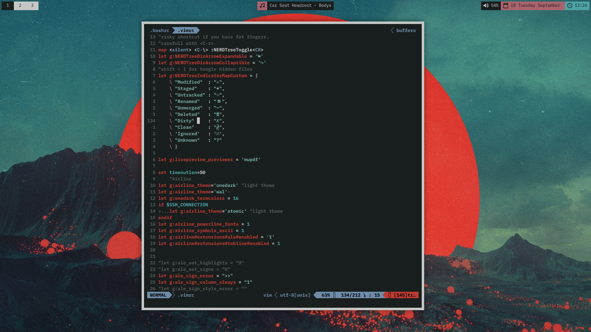

# Kevin Linux rice

An ongoing Arch Linux customization project.

## Hardware used

Laptop - Compaq Presario CQ61i  
OS     - Arch 
CPU    - Intel Celeron T3100 @ 1.89GHz  
GPU    - Intel Integrated Graphics  
RAM    - 2GB  

PC	   -  
OS     - Arch 
CPU    - AMD FX8350 @ 4.00GHz  
GPU    - NVIDIA GTX970  
RAM    - 32GB DDR3  

## Programs used  

+ Terminal emulator  -  Terminator  
+ Window Manager     -  i3-gaps  
+ Web Browser	     -  Vivaldi (with Vimum)  
+ File browser	     -  Ranger  
+ Composite Manager  -  Compton  
+ Text Editor	     -  Vim  
+ Music Player	     -   
+ PDF viewer	     -  MuPdf  
+ D-Menu		     -  Rofi

## To-Do

+ Make workspace script for: Python, Latex, HTML/CSS & GIMP
+ Finish automatic arch install script

